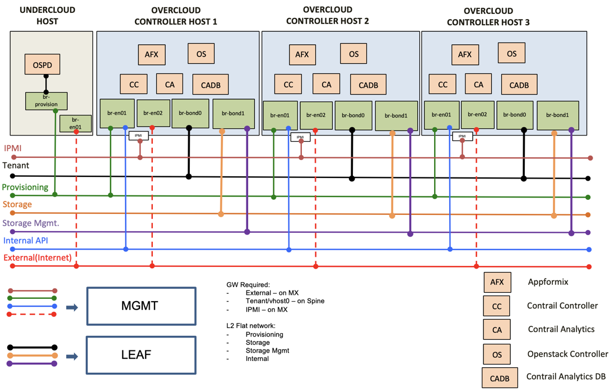
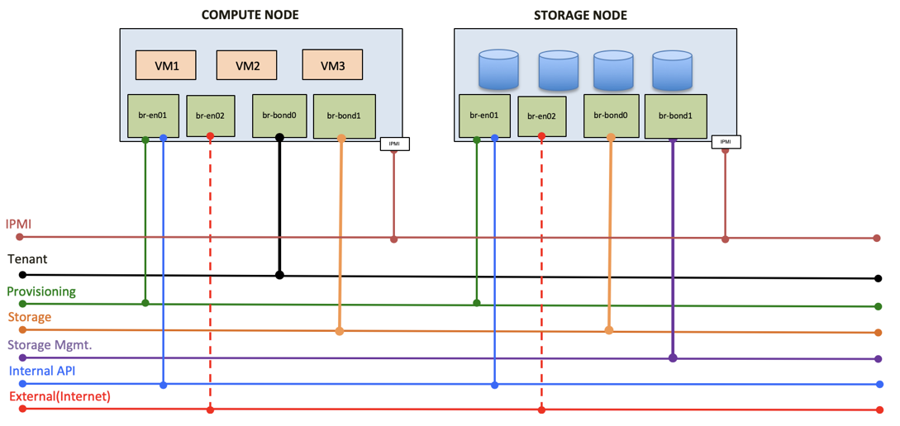

# Contrail Cloud Overview 

Juniper Networks Contrail Cloud is an integrated Telco Cloud platform built to run high-performance NFV with always-on reliability, allowing service providers to deliver innovative services with greater agility. Contrail Cloud Release 13.1 features Red Hat OpenStack combined with Juniper Contrail Networking, thereby bridging dynamic cloud orchestration with highly scalable connectivity. Furthermore, Contrail Cloud leverages AppFormix which has a built-in automation capability powered by machine learning to run the cloud infrastructure and VNFs in the most optimal manner, and remediating any potential failures to ensure adherence to SLAs.

* * *
### CC Controllers Topology 
* * *

### CC Compute and Storage Topology 

### CC Features tested 

1. IPv6 addressing support on External, Storage and Storage Mgmt networks
2. LDAP backend integration with keystone
3. Disk labeling
4. Multi-tenant subnet
5. Multiple role profiles
6. Proxy
7. Control VM's placement
8. Credentials are stored in ansible-vault, which is encrypted

### Build of Materials(BOM) for this Demo

* 1 QFX5100
* 6 Servers
  * 1 Jumphost
  * 3 Control Host
  * 1 DPDK Compute
  * 1 Kernel Compute

### Prerequisites for Deploying Contrail Cloud

* Bringup the infrastructure based on the above reference topology
* Setup undercloud Host with RedHat 7.6 minimal-OS, configured with DNS, NTP
* Undercloud host have access to Contrail Cloud repository satellite
* Install CentOS on 2 of the servers and validate the fabric connectivity using os-net-config [scripts](validate_fabric)

### Install Contrail Cloud

* Get licence keys for this installation
* Download the Contrail Cloud installer script from [here](https://support.juniper.net/support/downloads/)
* Run the downloaded script, ./contrail_cloud_installer.sh
* For the POC, the configuration files are created for single-subnet and interfaces are not bonded
* Make changes to the configuration [files](working-configs-131/single-subnet)

### Deployment steps

*  /var/lib/contrail_cloud/scripts/install_contrail_cloud_manager.sh
*  /var/lib/contrail_cloud/scripts/inventory-assign.sh
*  /var/lib/contrail_cloud/scripts/control-hosts-deploy.sh
*  /var/lib/contrail_cloud/scripts/control-vms-deploy.sh
*  /var/lib/contrail_cloud/scripts/compute-nodes-assign.sh
*  /var/lib/contrail_cloud/scripts/storage-nodes-assign.sh    << If CEPH is enabled
*  /var/lib/contrail_cloud/scripts/openstack-deploy.sh

## Reference

[CC13 Deployment Guide](https://www.juniper.net/documentation/en_US/contrail5.0/information-products/pathway-pages/contrail-cloud-deployment-guide-13.0.pdf)                                 
