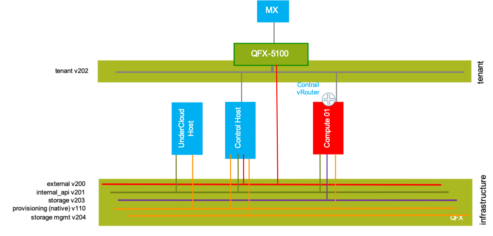
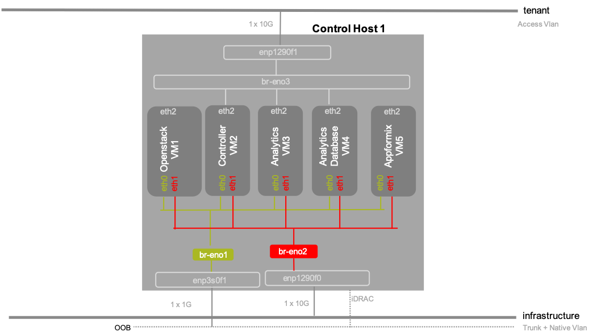

## CC 13.1 DEMO TOI

1. Introduction
```
* Juniper Networks Contrail Cloud is an integrated Telco Cloud platform built to run 
  high-performance NFV with always-on reliability, allowing service providers to deliver 
  innovative services with greater agility. 
* Contrail Cloud Release 13.1 features Red Hat OpenStack combined with Juniper Contrail 
  Networking, thereby bridging dynamic cloud orchestration with highly scalable connectivity. 
* Contrail Cloud leverages AppFormix which has a built-in automation capability powered by 
  machine learning to run the cloud infrastructure and VNFs in the most optimal manner, and 
  remediating any potential failures to ensure adherence to SLAs.
```

2. Supported Features 
```
1. IPv6 addressing support on External, Storage and Storage Mgmt networks
2. LDAP backend integration with keystone
3. Disk labeling
4. Multi-tenant subnet
5. Multiple role profiles 
6. Internet Proxy
7. Control VM's placement
8. Credentials are stored in ansible-vault, which is encrypted
```

3. Deployment prerequisties
  - Network prerequisties
```
1. Undercloud Host has access to the Contrail Cloud repository satellite
2. Undercloud host must have access to the Intelligent Platform Management 
   Interface (IPMI) of every managed server
3. Undercloud host must be in the same broadcast domain as each managed 
   server’s management interface to allow PXE booting
4. The Undercloud is the only DHCP server in this network
```
  - Undercloud Host setup
```
1. Runs Red Hat Enterprise Linux (RHEL) 7.6 with only base packages installed
2. Has at least 500GB space in the /var directory to host virtual machines, 
   packages, and images
3. Has at least 32GB RAM and 16 vCPUs.
4. Resolves internet and satellite sites with DNS
5. Has time synchronized with an NTP source
```

4. Pre-checks before deployment 
   - Install CentOS/Ubuntu on few of the nodes and validate the fabric connectivity 
   using os-net-config [scripts](https://github.com/urao/CC13.x/tree/master/validate_fabric)
   - Check the connectivity via ping with MTU size you plan to configure on the interfaces

5. DEMO
  - BOM
```
* 1 QFX5100
* 3 Servers
  * 1 Jumphost
  * 1 Control Host
  * 1 DPDK Compute
```
  - Topology




  - Deployment steps 
1. Download the Contrail Cloud Installer script from [Contrail Cloud – Download Software page](https://www.juniper.net/support/downloads/?p=contrailcloud#sw)
```
2. Copy the above downloaded script on to the Undercloud host.
3. Set ENV variables and RUN
./contrail_cloud_installer.sh  --satellite_host ${SATELLITE} \
       --satellite_key ${SATELLITE_KEY} --satellite_org ${SATELLITE_ORG}
3. cp /var/lib/contrail_cloud/samples/*.yml /var/lib/contrail_cloud/config 
```
4. Check the sample working [config files](https://github.com/urao/CC13.x/tree/master/demo/single-subnet-cfg)
```
5. Configure passwords in vault-data.yml
6. sudo /var/lib/contrail_cloud/scripts/install_contrail_cloud_manager.sh
7. /var/lib/contrail_cloud/scripts/inventory-assign.sh  
8. /var/lib/contrail_cloud/scripts/control-hosts-deploy.sh
9. /var/lib/contrail_cloud/scripts/control-vms-deploy.sh
10. /var/lib/contrail_cloud/scripts/compute-nodes-assign.sh
11. /var/lib/contrail_cloud/scripts/storage-nodes-assign.sh
12. /var/lib/contrail_cloud/scripts/openstack-deploy.sh
13. /var/lib/contrail_cloud/scripts/appformix-deploy.sh
```
  - Validate Deployment
```
/var/lib/contrail_cloud/scripts/overcloud-validation.sh
```

3. Check [FAQ Link](https://github.com/urao/CC13.x/blob/master/FAQ.md)

## Reference
[CC13 Deployment Guide](https://www.juniper.net/documentation/en_US/contrail5.0/information-products/pathway-pages/contrail-cloud-deployment-guide-13.0.pdf)
